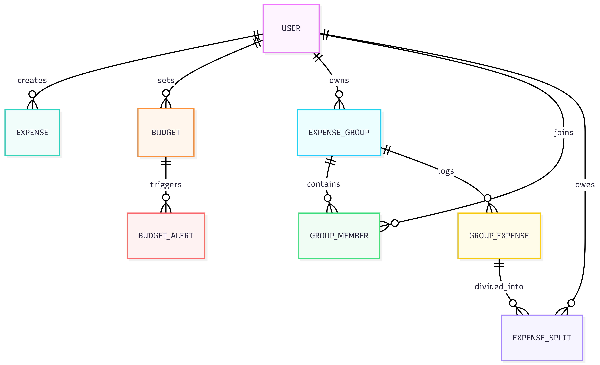

# SmartExpense Backend Documentation

## 1. Overview
The SmartExpense backend is a robust API designed to handle personal and group finance operations. It acts as the central source of truth for user authentication, expense tracking, budget enforcement, receipt OCR processing, and group settlement algorithms.

### Tech Stack
- **Framework:** Spring Boot 4.x (Java 17+)
- **Security:** Spring Security & JWT (JSON Web Tokens)
- **Database:** PostgreSQL with Spring Data JPA (Hibernate)
- **Validation:** Jakarta Validation
- **Cloud:** AWS S3 (Receipt Storage)
- **OCR Engine:** Tesseract OCR (Local CLI integration)

---

## 2. Architecture
The application follows a classic **Layered Monolithic Architecture**:
1. **Controller Layer:** Handles incoming HTTP requests, input validation, and routing.
2. **Service Layer:** Contains core business logic, algorithmic settlements, and AI integrations.
3. **Repository Layer:** Interfaces with the PostgreSQL database via Spring Data JPA.

### Request Lifecycle
`Client Request` → `JwtAuthenticationFilter` → `Controller` → `Service` → `Repository` → `Database` → `Service` → `Controller (DTO Mapping)` → `Client Response`

---

## 3. Project Structure

```text
smart-expense-backend/
├── src/main/java/com/smartexpense/smartexpensebackend/
│   ├── config/           # App configs (Security, CORS, S3)
│   ├── controller/       # REST API Endpoints
│   ├── dto/              # Data Transfer Objects (Request/Response shapes)
│   ├── exception/        # Global Error Handling & Custom Exceptions
│   ├── filter/           # Servlet Filters (e.g., JwtAuthenticationFilter)
│   ├── model/            # JPA Entities (Database Tables)
│   ├── repository/       # Spring Data JPA Interfaces
│   ├── scheduler/        # Background cron jobs (e.g., Budget Alerts)
│   ├── security/         # JWT Generation, Verification, UserDetails
│   ├── service/          # Core Business Logic and 3rd-party integrations
│   └── SmartExpenseBackendApplication.java  # Main Application class
├── src/main/resources/
│   └── application.properties # Environment and DB configuration
└── pom.xml               # Maven dependencies
```

---

## 4. API Design
The API strictly follows RESTful conventions returning JSON payloads.
- **Base Path:** `/api`
- **Versioning Strategy:** Versioning is currently handled globally via URL base (implicit v1), with DTOs used to contract endpoint shapes securely.

### Core Endpoint Groupings
- `/api/auth/*` - Registration, Login
- `/api/expenses/*` - CRUD for personal expenses, aggregation/summaries
- `/api/groups/*` - Group creation, member addition, shared expense creation
- `/api/budgets/*` - Budget CRUD operations
- `/api/ocr/*` - File upload

---

## 5. Database Design
- **Database Type:** Relational SQL (PostgreSQL).
- **Design Principles:** Highly normalized. Enforces referential integrity using Foreign Keys. Soft-deletes are not currently implemented (hard deletes on cascading). Base currency is hardcoded to `INR` to simplify aggregation without currency conversion rates.

---

## 6. ER Model

### Entities & Relationships

| Entity | Description | Relationships |
|--------|-------------|---------------|
| **User** | System users. | 1:M with Expenses, Budgets, GroupMembers. |
| **Expense** | Personal individual expenses. | M:1 with User. |
| **Budget** | Monthly category limits. | M:1 with User. 1:M with BudgetAlert. |
| **ExpenseGroup** | Shared spaces for bills. | M:1 with User (creator). 1:M with GroupMember, GroupExpense. |
| **GroupMember** | Join table for Users in Groups. | M:1 with ExpenseGroup, User. |
| **GroupExpense** | A bill paid by a single user in a group. | M:1 with ExpenseGroup. 1:M with ExpenseSplit. |
| **ExpenseSplit** | How much a specific user owes for a GroupExpense. | M:1 with GroupExpense, User. |

### Diagram



---

## 7. Core Modules

- **AuthService:** Manages user creation, password hashing (BCrypt), and JWT minting.
- **ExpenseService:** Handles personal transaction logging and aggregating data for the Financial Reports dashboard.
- **GroupService:** Complex logic. Handles creating shared expenses, generating equal/custom splits, and calculating "Who owes Who" balances across the entire group.
- **BudgetService:** Evaluates running expenses against defined category limits to trigger Warnings/Exceeded statuses.
- **OcrService:** Uploads receipts to AWS S3, calls the local Tesseract OCR CLI via `ProcessBuilder` to extract text from the image, and parses the Merchant, Amount, and Date using Regex logic.

---

## 8. Authentication & Authorization

- **Strategy:** Stateless JWT (JSON Web Tokens).
- **Implementation:** 
  - Login endpoint returns a JWT.
  - Clients provide this token in the `Authorization: Bearer <token>` header.
  - `JwtAuthenticationFilter` intercepts requests, validates the signature and expiration, and populates the `SecurityContext`.
- **Passwords:** Never stored in plaintext; hashed using `BCryptPasswordEncoder`.

---

## 9. Error Handling

- **Approach:** Handled globally using Spring's `@ControllerAdvice` (`GlobalExceptionHandler`).
- **Response Format:** A standardized JSON error shape ensuring the frontend can predictably parse errors.

```json
{
  "timestamp": "2026-05-01T12:00:00.000Z",
  "status": 400,
  "error": "Bad Request",
  "message": "Amount must be greater than 0"
}
```
- Custom exceptions (e.g., `ResourceNotFoundException`, `UnauthorizedException`) map cleanly to HTTP 404, 401, etc.

---

## 10. Logging & Monitoring

- **Framework:** SLF4J backed by Logback (Spring Boot default).
- **Strategy:** Error levels for exceptions. Info levels for major lifecycle events (User registration, Group creation). Debug logs are disabled in production to prevent PII/financial data leakage.

---

## 11. Environment Configuration

Application requires variables securely injected via environment (no hardcoded secrets in `application.properties`):

```properties
SPRING_DATASOURCE_URL=jdbc:postgresql://localhost:5432/smartexpense
SPRING_DATASOURCE_USERNAME=user
SPRING_DATASOURCE_PASSWORD=pass

JWT_SECRET=your_base64_encoded_jwt_secret_key_at_least_256_bits
JWT_EXPIRATION=86400000

# AWS S3 for Receipt Uploads
AWS_ACCESS_KEY_ID=aws_key
AWS_SECRET_ACCESS_KEY=aws_secret
AWS_REGION=us-east-1
S3_BUCKET_NAME=smart-expense-receipts
```
